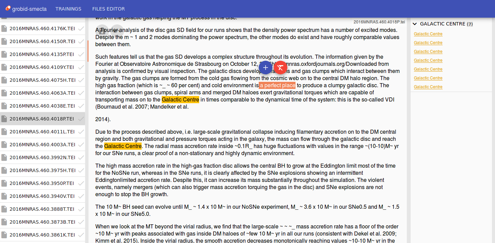
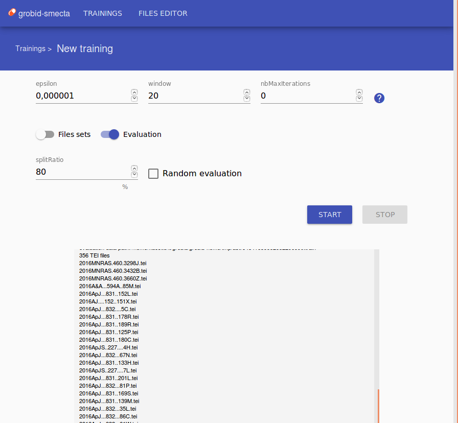
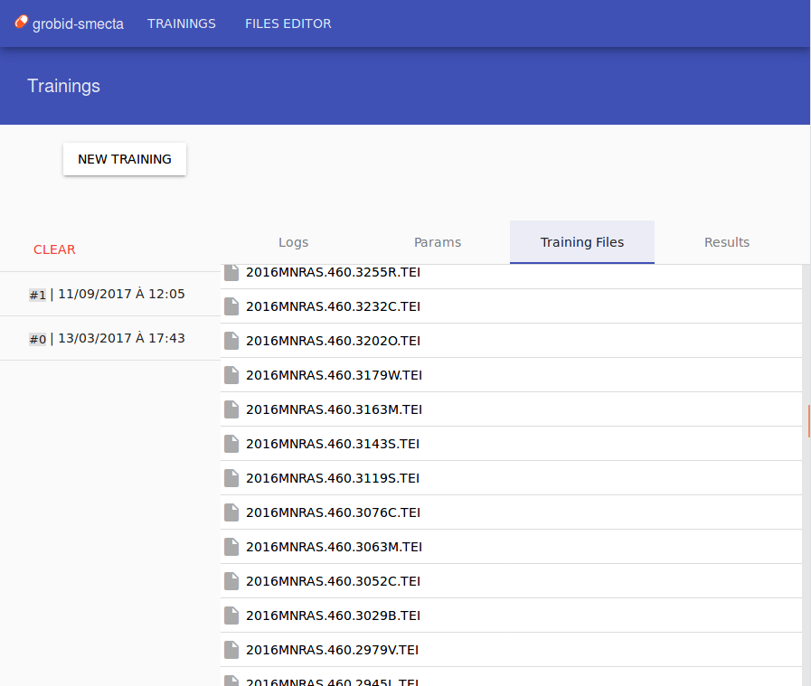

<div style="background: #3f51b5; padding: 8px 16px;">
	
	<h1 style="color: white; display: inline-block;">grobid-smecta</h1>
</div>

GROBID GUI to manage training data tasks.
<br />
Extension for GROBID [kermitt2/grobid](https://github.com/kermitt2/grobid)

grobid-smecta
SMECTA : Safe ManagemEnt and Curation of Training datA

## Screenshots

<a url="screenshots/files-editor.png" style="margin-right:10px;"></a>
<a url="screenshots/new-training.png" style="margin-right:10px;"></a>
<a url="screenshots/trainings.png"></a>

## Requirements

- Java
- Maven
- Grobid
- (MongoDB)

### Java

grobid and grobid-smecta need OpenJDK 1.8

### Grobid

https://github.com/kermitt2/grobid

### (Mongodb)

(https://docs.mongodb.com/v3.0/installation/)


## Configuration


Create a directory for Mongodb data.
<br />
`> mkdir data`
<br /><br />

Create a directory for training files deleted.
<br />
`> mkdir trainingTrash`
<br /><br />

Set your paths in properties file `grobid-smecta/src/main/resources/grobid-smecta.properties`
<br />
Specially `grobid.smecta.trainingFiles.mainDirectory`

In your project, make your Trainer extends `SmectaAbstractTrainer`
<br />
Add dependency in `grobid-YOUR_MODULE/pom.xml`
```
<dependency>
    <groupId>org.grobid</groupId>
    <artifactId>grobid-smecta</artifactId>
    <version>0.0.1-SNAPSHOT</version>
</dependency>
```

Extends your Trainer `grobid-YOUR_MODULE/.../YourTrainer.java`
```
public class YourTrainer extends SmectaAbstractTrainer {
	[...]
}
```

Edit dependency to your project `grobid-smecta/pom.xml`
```
<dependency>
    <groupId>org.grobid</groupId>
    <artifactId>grobid-YOUR_MODULE</artifactId>
    <version>0.4.2-SNAPSHOT</version>
</dependency>
```

Edit `grobid-smecta/src/main/java/org/grobid/service/main/trainer/TrainerMain.java`
```
public static void main(String[] args) {

	YourTrainer trainer = new YourTrainer();
	
	try {
		TrainerService.runTrainer(args, trainer);
	} catch (Exception e) {
		e.printStackTrace();
	}
}
```

## Install

`> mvn clean install`


## Usage

### Start MongoDB

Run this command
<br />
`> mongod --dbpath ./data --port 27042`
<br /><br />
Or use the script
<br />
`> ./db_start.sh`

### Start Webservice

`> mvn jetty:run-war`

### Start Webapp

`> mvn exec:exec -Pclient-prod`

## Developpment

### Server part (java)

To build sources, instead of using `mvn clean install`, you should use `mvn compile`, then you avoid to install again client tools.

### Client part (angular)

To have only local access, and a dynamic building, instead of using `mvn exec:exec -Pclient-prod`, you should use `mvn exec:exec -Pclient-dev`.

